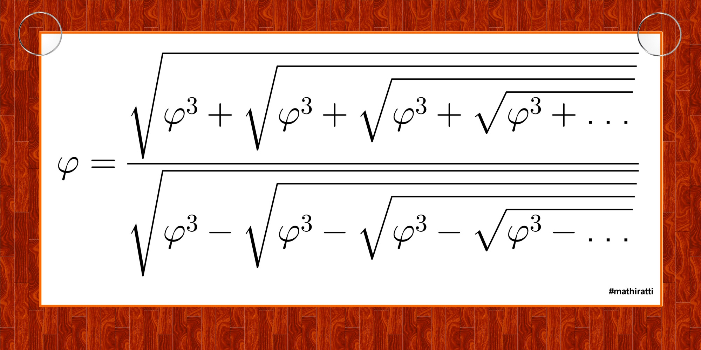

# Weird Golden Ratio Identity

I saw this strange looking identity:



Regrettably, I can't remember where I found this image.
If you know, can you please tell me?

Here, &phi; is the [Golden Ratio](https://en.wikipedia.org/wiki/Golden_ratio),
(1 + √5)/2 .

This identity is of no use finding &phi;
because you have to know the numeric value of the Golden Ratio
to find the numeric value of the Golden Ratio.

It actually works to the limit of accuracy of IEEE 754 floating point numbers.

```
1583 % go build fphi2.go
1584 % ./fphi2
Original phi := 1.618034e+00
1       1.700016e+00    8.198179e-02
2       1.563183e+00    -5.485116e-02
3       1.629114e+00    1.108003e-02
4       1.613419e+00    -4.615044e-03
5       1.619229e+00    1.195016e-03
6       1.617620e+00    -4.139540e-04
7       1.618153e+00    1.193473e-04
8       1.617995e+00    -3.852182e-05
9       1.618046e+00    1.159002e-05
10      1.618030e+00    -3.641497e-06
11      1.618035e+00    1.113825e-06
12      1.618034e+00    -3.463797e-07
13      1.618034e+00    1.066191e-07
14      1.618034e+00    -3.302698e-08
15      1.618034e+00    1.019065e-08
16      1.618034e+00    -3.151995e-09
17      1.618034e+00    9.734640e-10
18      1.618034e+00    -3.009231e-10
19      1.618034e+00    9.297008e-11
20      1.618034e+00    -2.873324e-11
21      1.618034e+00    8.878231e-12
22      1.618034e+00    -2.743583e-12
23      1.618034e+00    8.477663e-13
24      1.618034e+00    -2.620126e-13
25      1.618034e+00    8.104628e-14
26      1.618034e+00    -2.486900e-14
27      1.618034e+00    7.771561e-15
28      1.618034e+00    -2.442491e-15
29      1.618034e+00    8.881784e-16
30      1.618034e+00    -2.220446e-16
```
